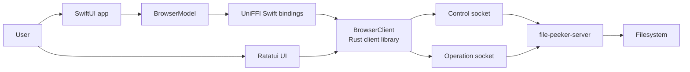
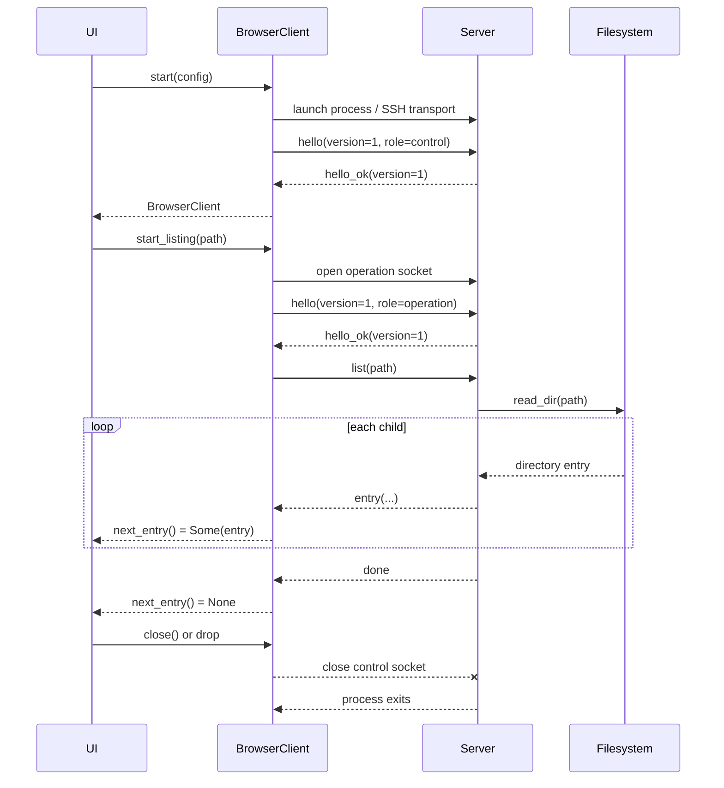

# File Peeker API

This document describes the implemented interfaces between File Peeker's UI,
shared client, and server. File Peeker does not expose an HTTP API. Its public
application API is the Rust client library (also exported to Swift through
UniFFI); its server protocol is a private, versioned NDJSON protocol over Unix
domain sockets.

## Component boundaries



| Component | Responsibility | Communicates with |
| --- | --- | --- |
| UI | Presents entries, accepts navigation, and displays loading or error state | Public client API only |
| Client | Starts and owns a server, normalizes paths, performs handshakes, maps protocol data to UI-safe types, and supervises shutdown | UI through Rust/UniFFI; server through private sockets |
| Server | Reads the filesystem and streams results | Client through the private wire protocol; local filesystem through OS APIs |

The UI never opens a socket or encodes protocol messages. The server never
contains rendering or navigation state. One `BrowserClient` owns one dedicated
server lifecycle.

## Public client API

The `file-peeker-client` crate is the supported API for a UI. The same objects,
records, enums, errors, and asynchronous methods are exported through UniFFI.

### Configuration

```rust
pub struct ClientConfig {
    pub target: ServerTarget,
}

pub enum ServerTarget {
    Local { server_executable_path: String },
    Ssh { destination: String },
}
```

- `Local` starts the executable at `server_executable_path` on the current
  machine.
- `Ssh` uses the named SSH destination, provisions a compatible remote server
  when necessary, and forwards a local Unix socket to the remote server.
- For both targets, the returned client has the same API and protocol behavior.

### BrowserClient

```rust
impl BrowserClient {
    pub async fn start(
        config: ClientConfig,
    ) -> Result<Arc<BrowserClient>, ClientError>;

    pub async fn start_listing(
        &self,
        path: String,
    ) -> Result<Arc<DirectoryListing>, ClientError>;

    pub async fn current_root(&self) -> Result<String, ClientError>;

    pub async fn close(&self) -> Result<(), ClientError>;

    pub async fn open(&self, path: String) -> Result<(), ClientError>;

    pub async fn metadata(
        &self,
        path: String,
    ) -> Result<FileMetadata, ClientError>;
}
```

| Method | Behavior | Status |
| --- | --- | --- |
| `start` | Starts a local server or SSH transport, opens the control connection, negotiates protocol v1, and returns an owning client | Implemented |
| `start_listing` | Normalizes the supplied path, opens one operation connection, and returns a pull-based listing | Implemented |
| `current_root` | Returns the server process's absolute current working directory | Implemented |
| `close` | Closes control, waits for the owned server/SSH process, and cleans up private endpoints | Implemented; idempotent |
| `open` | Opens a path with the macOS default application for local clients; succeeds without action for SSH clients | Implemented |
| `metadata` | Intended to return metadata for one path | Reserved; currently returns `ClientError::NotImplemented` without contacting the server |

`start_listing` accepts absolute or relative UTF-8 paths. Relative paths are
resolved against the client process's current working directory. An empty or
non-UTF-8 path is rejected. The normalized absolute path is sent to the server.

Dropping the last `BrowserClient` also initiates shutdown. Calls that begin
after the lifecycle has closed return `ConnectionClosed`.

### DirectoryListing

```rust
impl DirectoryListing {
    pub async fn next_entry(
        &self,
    ) -> Result<Option<DirectoryEntry>, ClientError>;
}
```

`DirectoryListing` is a pull-based asynchronous stream:

- `Ok(Some(entry))` returns the next direct child.
- `Ok(None)` means the listing completed successfully. Later calls also return
  `Ok(None)`.
- `Err(error)` means the listing failed. Entries returned before the error are
  still valid.
- Dropping the listing aborts its operation task and closes that operation's
  socket.

The internal queue holds up to 64 results, providing backpressure when a UI
consumes entries more slowly than the server produces them.

### Data types

```rust
pub enum EntryKind {
    File,
    Directory,
    Symlink,
    Other,
}

pub struct DirectoryEntry {
    pub path: String,
    pub name: String,
    pub kind: EntryKind,
    pub navigable: bool,
}

pub struct FileMetadata {
    pub path: String,
    pub kind: EntryKind,
    pub size: u64,
    pub readonly: bool,
    pub modified: Option<String>,
}
```

`DirectoryEntry.path` is the absolute path used for later operations, while
`name` is the final path component intended for display. `navigable` is true
for directories and for symlinks whose current target is a directory.

`FileMetadata` is exported as part of the reserved metadata API, but no
implemented public operation currently returns it.

### Errors

```rust
pub enum ClientError {
    NotImplemented { operation: String },
    InvalidPath { message: String },
    ServerStart { message: String },
    ServerExited { message: String },
    ConnectionClosed { message: String },
    Protocol { message: String },
    Io { message: String },
}
```

| Error | Meaning |
| --- | --- |
| `NotImplemented` | The public API exists but the operation is not implemented |
| `InvalidPath` | A path is empty, invalid, or cannot be represented as UTF-8 |
| `ServerStart` | The server or SSH transport could not be prepared or started |
| `ServerExited` | The owned process exited unexpectedly |
| `ConnectionClosed` | A required connection closed or an operation was cancelled |
| `Protocol` | Negotiation, framing, JSON, versioning, or message order was invalid |
| `Io` | A local or remote filesystem operation failed |

At the wire boundary, `invalid_path` maps to `InvalidPath`;
`not_found`, `permission_denied`, `not_directory`, and `io` map to `Io`; and
`unsupported_version` maps to `Protocol`.

### Swift API names

UniFFI exposes the same API using Swift naming conventions. The SwiftUI app
currently uses:

```swift
let client = try await BrowserClient.start(
    config: ClientConfig(
        target: .local(serverExecutablePath: serverURL.path)
    )
)

let listing = try await client.startListing(path: path)
while let entry = try await listing.nextEntry() {
    // Update UI state.
}

let root = try await client.currentRoot()
try await client.open(path: "/tmp/example/report.txt")
try await client.close()
```

The metadata call is exposed as `metadata(path:)`, subject to the same
not-implemented behavior as Rust.

## UI integration

The UIs are consumers of the client API; they do not expose a network or
library API of their own.

### SwiftUI

`ContentView` owns a main-actor `BrowserModel`. When the view task starts:

1. `BrowserModel.start()` locates the bundled `file-peeker-server` executable.
2. It calls `BrowserClient.start` with a local target.
3. It calls `startListing` for the user's home directory.
4. It repeatedly awaits `nextEntry` and appends each result to published state.
5. Double-clicking an entry or choosing `Open` from its right-click menu opens
   it: navigable entries start a new listing, while other entries call
   `BrowserClient.open`.

The model uses a generation counter and cancels the previous Swift task when a
new directory is opened. Results from an older generation are ignored.
`ContentView` observes `currentPath`, `entries`, `isLoading`, and
`errorMessage` and renders them on the main actor.

### Ratatui

The terminal UI locates a sibling `file-peeker-server`, starts a local
`BrowserClient`, and spawns Tokio tasks for listings and file opening. Those
tasks convert client results into entry, completion, or operation-failure
events. The main loop owns all application state and rendering.

The terminal UI accepts an optional starting path. Arrow keys or `j`/`k` move
the selection, Enter navigates into directories or opens non-navigable entries
with `BrowserClient.open`, and `q` or Escape exits. Its `--smoke [PATH]` mode
consumes one listing without interactive rendering and is intended for
verification.

## Client-server wire API

The wire API is private to the shared client and dedicated server. External UIs
should not depend on it directly.

### Transport and framing

- Transport: Unix domain stream socket. Remote operation uses SSH Unix-socket
  forwarding; it does not expose a TCP listener.
- Encoding: one UTF-8 JSON object followed by `\n` (NDJSON).
- Protocol version: `1`.
- Maximum message payload: 1 MiB, excluding the newline delimiter.
- Paths: absolute UTF-8 strings.
- One client owns one server and one private, owner-only socket directory.
- There is no authentication token or request ID because the endpoint is
  private and each operation has its own connection.

### Connection model

The first accepted connection must be the long-lived control connection. It
performs a handshake and then carries no more messages. Closing it is the
shutdown signal for the dedicated server.

Every filesystem operation opens a separate connection, performs an operation
handshake, sends exactly one request, receives its responses, and closes.
Multiple operation connections may run concurrently.



### Handshake messages

Control request:

```json
{"type":"hello","version":1,"role":"control"}
```

Operation request:

```json
{"type":"hello","version":1,"role":"operation"}
```

Success:

```json
{"type":"hello_ok","version":1}
```

Unsupported version:

```json
{"type":"error","code":"unsupported_version","message":"Unsupported protocol version"}
```

No operation request may be sent before `hello_ok`.

### Current-root operation

Request:

```json
{"type":"current_root"}
```

Successful response:

```json
{"type":"current_root","path":"/home/example"}
```

The response is terminal; there is no following `done` message.

### Directory-listing operation

Request:

```json
{"type":"list","path":"/tmp/example"}
```

The server sends zero or more entries in filesystem enumeration order:

```json
{"type":"entry","path":"/tmp/example/docs","name":"docs","kind":"directory","navigable":true}
```

Success terminates with:

```json
{"type":"done"}
```

Failure terminates with an error and may occur after entries have already been
sent:

```json
{"type":"error","code":"permission_denied","message":"Permission denied"}
```

Entry `kind` is `file`, `directory`, `symlink`, or `other`.

### Wire errors

| Code | Meaning |
| --- | --- |
| `not_found` | The path does not exist |
| `permission_denied` | OS permissions rejected the operation |
| `not_directory` | A listing path is not a directory |
| `invalid_path` | The supplied path is invalid |
| `io` | Another filesystem I/O error occurred |
| `unsupported_version` | Protocol negotiation failed |

An operation error is terminal. Malformed JSON, an oversized message, or an
invalid message sequence causes a protocol failure and connection closure.

### Reserved metadata messages

The shared protocol schema declares these messages:

```json
{"type":"get_metadata","path":"/tmp/example/docs"}
```

```json
{"type":"metadata","path":"/tmp/example/docs","kind":"directory","size":96,"readonly":false,"modified":"2026-07-16T12:10:00Z"}
```

They are not operational in the current implementation. The server accepts
only `list` and `current_root` after an operation handshake, while the public
client `metadata` method immediately returns `NotImplemented`.

## Process command-line interfaces

These CLIs are process entry points, separate from the client library API.

### Server

```text
file-peeker-server serve --socket PATH [--remove-parent-on-exit]
file-peeker-server version --format json
file-peeker-server --version
```

- `serve` requires an absolute, unused socket path no longer than 100 bytes.
  The parent must already exist, be a directory, and have no group or other
  permission bits.
- `--remove-parent-on-exit` removes the socket's parent directory after the
  socket is removed. It is used for an owned remote runtime directory.
- `version --format json` writes
  `{"server_version":"<package-version>","protocol_versions":[1]}`.

The server CLI is normally invoked by the client, not by a UI or end user.

### Client diagnostics

```text
file-peeker-client connect SSH_DESTINATION
file-peeker-client install SSH_DESTINATION
file-peeker-client open PATH
```

- `connect` ensures a compatible remote server is installed, starts it through
  SSH, prints its current root to stdout, and closes it.
- `install` overwrites and verifies the versioned remote server installation,
  then prints its remote executable path to stdout.
- `open` starts the sibling local server, opens `PATH` with the macOS default
  application through `BrowserClient.open`, and shuts the server down.
- Progress and diagnostics are written to stderr.

### Terminal UI

```text
file-peeker-tui [PATH]
file-peeker-tui --smoke [PATH]
```

The first form opens the interactive browser. The second performs a
non-interactive listing smoke test.

## Stability and extension rules

- UI consumers should depend on the public `file-peeker-client` types, not the
  private wire schema.
- A breaking wire change requires a new protocol version.
- Adding an operation requires coordinated protocol, server, client, UniFFI,
  and UI work.
- The current API is read-only: it exposes no write, delete, rename, upload, or
  download operation.
- The current UI chooses only local targets; SSH is available through the
  public client API and diagnostic CLI but is not selectable in either UI.
