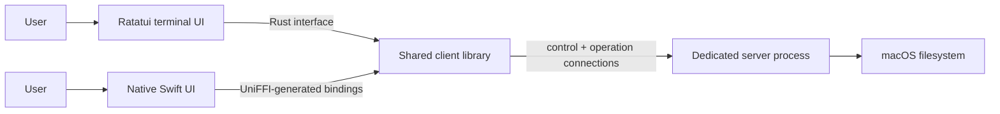
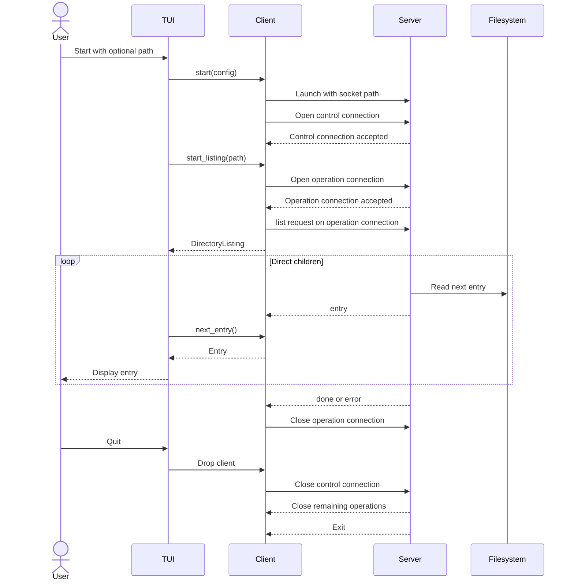

# File Peeker v1 Architecture

Status: local startup, directory listing, minimal Ratatui and SwiftUI navigation,
and diagnostic SSH startup are implemented. Metadata and remote UI selection
remain pending.

## Goal

V1 proves one architectural idea: filesystem work belongs in a server process,
while a UI talks to it through a client.



V1 is local, macOS-only, read-only, and one-to-one: each `BrowserClient` owns one
dedicated server process. Local launch, control and operation handshakes,
directory listing, and drop-managed shutdown are implemented. Remote
connections and metadata are future work.

## Components

### Server

The server is the only component that reads browser data from the filesystem. It:

- Listens on a private Unix domain socket supplied by its owning client.
- Accepts one control connection and multiple operation connections from that
  client.
- Handles each operation connection independently.
- Streams direct directory children in filesystem enumeration order.
- Returns basic metadata when requested.
- Stops active operations and exits when the control connection closes.

It contains no terminal or navigation logic.

The server is never shared by different `BrowserClient` instances. Because every
connection to its private socket belongs to the one owning client, v1 does not
use session IDs or session tokens.

### Client

The shared Rust client library is the only interface between a UI and the server.
It owns the dedicated local or SSH server lifecycle and:

- Accepts one `ServerTarget` configuration for either a local executable or an
  SSH destination.
- Creates a private temporary Unix socket path.
- Starts the server locally or provisions and starts it through SSH forwarding.
- Opens a long-lived control connection and checks the protocol version.
- Opens one additional connection for each filesystem operation.
- Converts paths to absolute UTF-8 paths before sending them.
- Converts protocol messages into UI-independent asynchronous operations and
  data types.
- Closes the control connection and waits for the server when dropped.

The logical UI-facing interface is:

```rust
impl BrowserClient {
    async fn start(config: ClientConfig)
        -> Result<Arc<BrowserClient>, ClientError>;
    async fn start_listing(&self, path: String)
        -> Result<Arc<DirectoryListing>, ClientError>;
    async fn metadata(&self, path: String)
        -> Result<FileMetadata, ClientError>;
}

struct ClientConfig {
    target: ServerTarget,
}

enum ServerTarget {
    Local { server_executable_path: String },
    Ssh { destination: String },
}

impl DirectoryListing {
    async fn next_entry(&self)
        -> Result<Option<DirectoryEntry>, ClientError>;
}
```

These signatures define the API shared by the native Rust facade and UniFFI
bindings. `start` launches and connects to the configured local or SSH server,
listing streams direct children, and metadata currently returns a typed
`NotImplemented` error.

`start_listing` begins the operation and returns a listing object.
`next_entry` asynchronously waits for one result:

- `Some(entry)` means another entry is available.
- `None` means the listing completed successfully.
- `Err` means the listing failed, possibly after earlier entries were returned.

This pull-based stream lets each UI consume results using its own event model.
It avoids callbacks crossing the language boundary and does not expose Rust
iterators or channels through UniFFI. Different listing or metadata objects may
operate concurrently because each owns a separate operation connection.

The library provides two bindings over the same implementation:

- A safe Rust facade used by the TUI.
- Swift bindings generated with UniFFI.

The UniFFI boundary exposes only language-neutral records, enums, errors,
strings, async functions, and client/listing objects. Rust-specific types such
as `Path`, borrowed references, trait objects, streams, and channels remain
behind the Rust facade. The exported UniFFI API mirrors the logical interface
without exposing the server protocol.

Objects exported through UniFFI must be safe for calls from different threads.
The client therefore uses shared ownership and internal synchronization rather
than exposing mutable references.

Starting and closing the client are also part of this shared interface.
Configuration supplies the server executable path. Startup uses bounded internal
timeouts, and dropping the final client closes control and supervises server
exit. Packaging and automatic server discovery remain deferred.

### Ratatui terminal UI

The planned command is:

```text
file-peeker [PATH]
```

The Rust TUI uses Ratatui for rendering and terminal interaction. It passes
`PATH`, or its current directory when omitted, to the client. It:

- Runs directory consumption outside the main rendering path.
- Converts each client result into a TUI application event.
- Updates TUI state and calls `Terminal::draw` from the main event loop.
- Keeps entries in arrival order.
- Remains responsive to terminal and quit events while a listing is active.
- Waits for the listing to finish before starting another navigation operation.
- Allows selection movement and Enter to open a navigable child.
- Allows `q` or Escape to quit.
- Displays errors returned by the client.

The TUI does not start the server directly, encode protocol messages, read browser
data from the filesystem, show metadata, or preview files. V1 has no parent
navigation.

### Native Swift UI

A native macOS UI written in Swift is a functional peer of the Rust TUI. It:

- Use the same compiled Rust client library as the TUI.
- Call the client through UniFFI-generated Swift bindings.
- Repeatedly awaits `nextEntry()` in a main-actor observable model.
- Apply entry, completion, and error state on `MainActor`.
- Starts in the user's home directory and opens navigable entries on
  double-click.
- Receive the same directory-entry, metadata, and error concepts as the TUI.
- Keep its Xcode project definition in an XcodeGen `project.yml` file.

It does not implement the server protocol, manage sockets, or start the server
itself. Those responsibilities remain inside the shared client. The skeleton
uses SwiftUI, but screens and user interactions are not specified yet.

XcodeGen is the source of truth for project structure and build settings. The
generated `.xcodeproj` is an output, not a manually maintained project
definition. The future Swift integration will include the UniFFI-generated
Swift source, module map, and native library artifacts through settings defined
by XcodeGen.

## Directory listing example

Both UIs use the same client sequence:

```text
start_listing(path) -> DirectoryListing
next_entry()        -> entry, entry, ..., None
```

The client starts the configured local or SSH server during
`BrowserClient.start`, sends the private `list` protocol message, and converts
server responses into `DirectoryEntry` values. The UI only consumes those
values.

### Inside the shared client

The client separates its public async objects from control-lifecycle management
and per-operation tasks:

```text
Ratatui or SwiftUI
        │
        ▼
BrowserClient.start_listing(path)
        │ open operation connection
        ▼
Listing task ── list message ──> Dedicated server
        │
        │ Entry / Done / Error
        ▼
bounded listing queue
        │
        ▼
DirectoryListing.next_entry()
        │
        ▼
Ratatui event or SwiftUI state update
```

`BrowserClient` and `DirectoryListing` are shared, thread-safe objects. The
control worker owns the control connection. Each operation object controls a
dedicated operation connection through its task and handle, so UI threads never
read from or write to sockets directly.

The internal types are conceptually:

```rust
struct BrowserClient {
    socket_path: String,
    control: ControlConnection,
    process: ChildProcess, // the local server or SSH process
    state: SharedClientState,
}

struct DirectoryListing {
    results: AsyncMutex<ListingReceiver>,
    operation: OperationHandle,
    finished: AtomicBool,
}

enum ListingItem {
    Entry(DirectoryEntry),
    Done,
    Error(ClientError),
}
```

These types are illustrative. Channel, mutex, and runtime types remain internal
and are not exported through UniFFI.

`BrowserClient.start(config)` performs these steps:

1. Validate the selected local or SSH target.
2. For SSH, ensure the compatible remote server is installed.
3. Create a private local socket location.
4. Launch the local server or SSH process; SSH forwards the local socket to the
   remote server socket.
5. Open a control connection and identify it during the version handshake.
6. Keep that connection open for the lifetime of the client.
7. Return a thread-safe `BrowserClient`.

`start_listing(path)` then:

1. Converts `path` to an absolute UTF-8 path.
2. Rejects the call if the client or control connection is closed.
3. Creates a bounded queue for listing results.
4. Opens a new connection to the dedicated server.
5. Identifies it as an operation connection and completes its handshake.
6. Sends one `list` request on that connection.
7. Starts an operation task that owns the connection and result sender.
8. Returns a `DirectoryListing` connected to that result queue.

`OperationHandle` lets `DirectoryListing` close its operation connection when
the listing is abandoned; the socket itself remains owned by the operation
task.

The operation task handles the server stream:

```rust
async fn run_listing(
    socket: &mut ServerConnection,
    path: String,
    results: ListingSender,
) -> Result<(), ClientError> {
    socket.send(ServerRequest::List { path }).await?;

    loop {
        match socket.receive().await? {
            ServerMessage::Entry(entry) => {
                results.send(ListingItem::Entry(entry)).await?;
            }
            ServerMessage::Done => {
                results.send(ListingItem::Done).await?;
                return Ok(());
            }
            ServerMessage::Error(error) => {
                results.send(ListingItem::Error(error.into())).await?;
                return Ok(());
            }
            message => {
                return Err(ClientError::UnexpectedMessage(message.kind()));
            }
        }
    }
}
```

The bounded queue provides backpressure. If a UI consumes entries slowly, its
operation task eventually waits before reading more server messages rather than
storing an unlimited directory in memory. Other operation connections continue
independently. The exact queue capacity is an implementation choice.

`DirectoryListing.next_entry()` translates the internal queue into the public
contract:

```rust
async fn next_entry(&self) -> Result<Option<DirectoryEntry>, ClientError> {
    if self.finished.load() {
        return Ok(None);
    }

    match self.results.lock().await.receive().await {
        Some(ListingItem::Entry(entry)) => Ok(Some(entry)),
        Some(ListingItem::Done) => {
            self.finished.store(true);
            Ok(None)
        }
        Some(ListingItem::Error(error)) => {
            self.finished.store(true);
            Err(error)
        }
        None => {
            self.finished.store(true);
            Err(ClientError::ConnectionClosed)
        }
    }
}
```

Only one `next_entry()` call may wait on a listing at a time. The internal mutex
enforces this for calls arriving from different threads or Swift tasks.
Repeated calls after successful completion return `None`.

If an operation connection fails or receives an invalid message, only that
operation fails unless the control connection or server process also fails. If a
`DirectoryListing` is dropped before `Done` or `Error`, it closes its operation
connection. The server stops that operation, while the `BrowserClient` and other
operations remain usable.

If the control connection closes or the server exits, all operation connections
fail and the client becomes invalid. Dropping `BrowserClient` closes the control
connection; the server then closes active operation connections and exits.

### Ratatui

The Ratatui integration consumes the listing in a background task and forwards
results to the main application event loop:

```rust
enum AppEvent {
    DirectoryEntry(DirectoryEntry),
    ListingFinished,
    ListingFailed(ClientError),
}

let listing = client.start_listing(path).await?;
let events = app_event_sender.clone();

spawn(async move {
    loop {
        match listing.next_entry().await {
            Ok(Some(entry)) => {
                events.send(AppEvent::DirectoryEntry(entry)).await?;
            }
            Ok(None) => {
                events.send(AppEvent::ListingFinished).await?;
                break;
            }
            Err(error) => {
                events.send(AppEvent::ListingFailed(error)).await?;
                break;
            }
        }
    }
});
```

The main event loop owns state and rendering:

```rust
loop {
    let event = next_app_event().await;
    app.update(event);
    terminal.draw(|frame| app.render(frame))?;
}
```

The background task never calls Ratatui. It only sends application events.

### SwiftUI

UniFFI generates Swift async methods for the same client and listing objects.
The SwiftUI model consumes them in a task and changes observable state on the
main actor:

```swift
@MainActor
final class BrowserModel: ObservableObject {
    @Published var entries: [DirectoryEntry] = []
    @Published var isLoading = false
    @Published var errorMessage: String?

    private let client: BrowserClient

    func openDirectory(_ path: String) {
        entries = []
        isLoading = true
        errorMessage = nil

        Task {
            do {
                let listing = try await client.startListing(path: path)

                while let entry = try await listing.nextEntry() {
                    entries.append(entry)
                }

                isLoading = false
            } catch {
                errorMessage = String(describing: error)
                isLoading = false
            }
        }
    }
}
```

Because the model is isolated to `MainActor`, its state changes occur in the UI
context and SwiftUI redraws affected views automatically. The client does not
know about `ObservableObject`, properties, views, or rendering.

The examples are illustrative. Exact runtime, channel, observation, and
generated UniFFI syntax will be chosen during implementation.

## Lifecycle



The client uses bounded startup and shutdown waits. Unexpected server exit,
connection loss, and invalid protocol data become client errors rather than
panics.

Async client methods suspend while waiting for server I/O; they do not render UI
or choose a UI thread. The implementation may use one task per operation and
channels internally. Ratatui and SwiftUI remain responsible for scheduling
their own state updates.

Closing an operation connection is the v1 cancellation mechanism. Dropping an
unfinished `DirectoryListing` closes only its connection. Closing the control
connection ends the entire client-server lifetime.

## Filesystem behavior

- A listing returns direct children only; it does not recurse.
- Hidden entries are included.
- Synthetic `.` and `..` entries are not included.
- No component sorts the entries.
- A normal directory is navigable.
- A symlink remains type `symlink` and is navigable only when its target is a
  directory.
- Broken symlinks and symlinks to files are not navigable.
- A listing can return some entries and then end with an error. Already returned
  entries remain visible.

The starting path is only the initial location, not a security boundary. Access
is limited by the permissions of the account running the server. The UI simply
does not expose parent navigation in v1.

## Deferred work

- Parent navigation, sorting, previews, search, and recursive walking.
- Creating, renaming, moving, copying, or deleting files.
- Reconnection and sharing one server between multiple clients.
- Non-UTF-8 paths.
- Remote transport, authentication, encryption, and allowed roots.
- Native Swift UI behavior and interaction design beyond the compilation shell.
- Distributable UniFFI/XCFramework packaging for Swift.
- Linux and Windows support.
